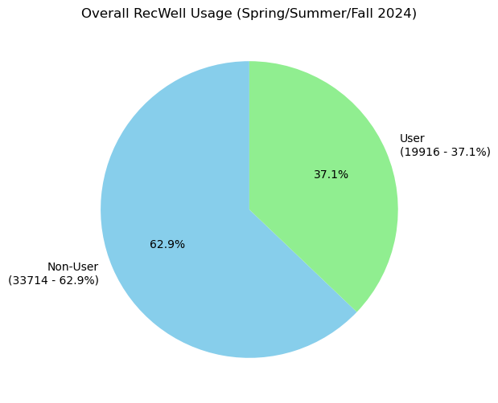
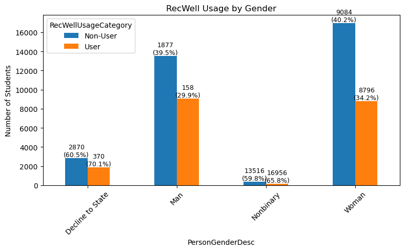
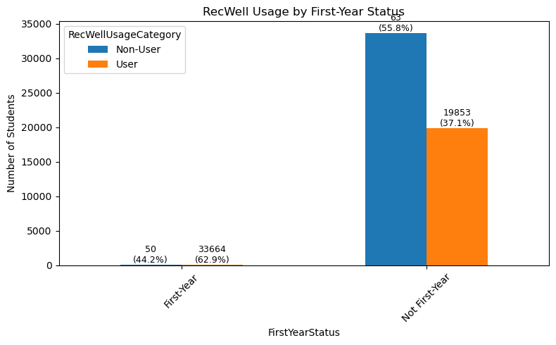
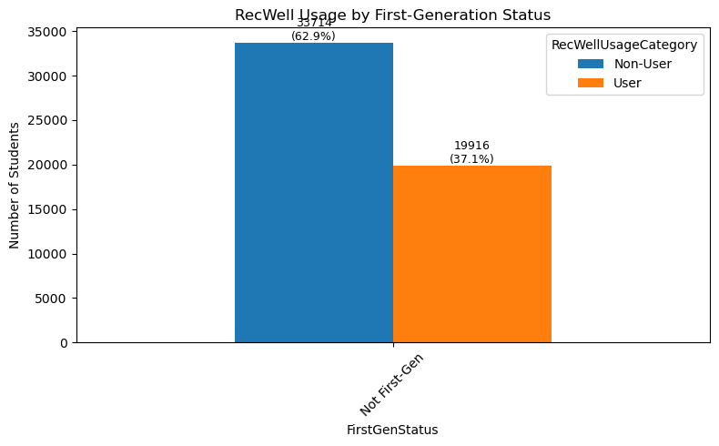
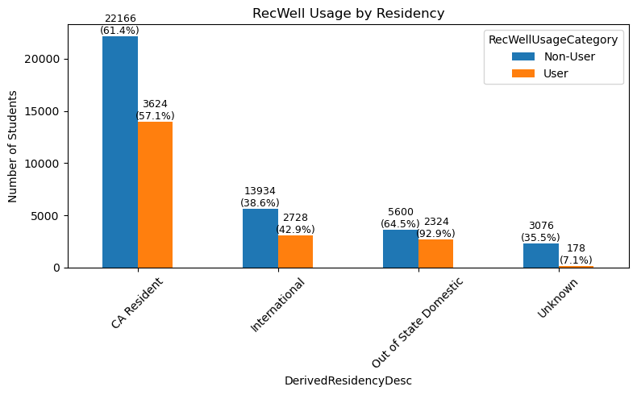
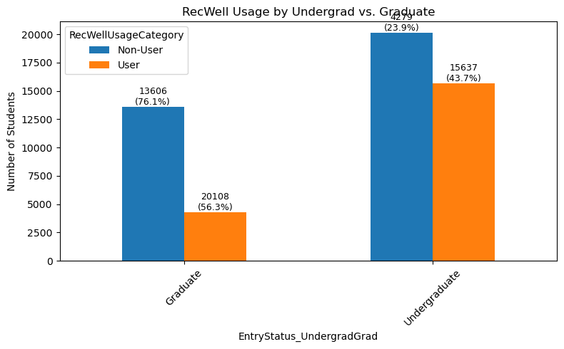
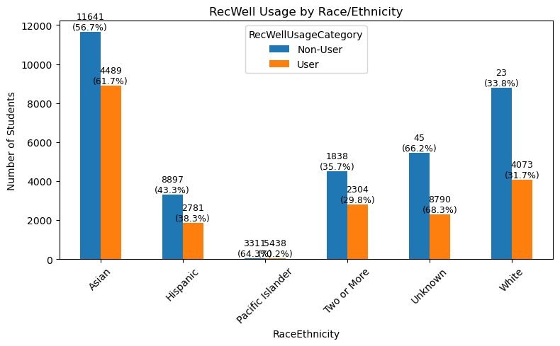

```python
import pandas as pd
import matplotlib.pyplot as plt
import seaborn as sns
import numpy as np

```


```python
df = pd.read_csv("Swipe Data RSF - Sheet1 (1).csv")
pd.set_option('display.max_columns', None)
df
```


<div>
<style scoped>
    .dataframe tbody tr th:only-of-type {
        vertical-align: middle;
    }

    .dataframe tbody tr th {
        vertical-align: top;
    }

    .dataframe thead th {
        text-align: right;
    }
</style>
<table border="1" class="dataframe">
  <thead>
    <tr style="text-align: right;">
      <th></th>
      <th>SemesterYearNameConcat</th>
      <th>TermTotalUnitsAttemptedNo</th>
      <th>UngradGradCd</th>
      <th>ReportingCollegeSchoolNmFirstMaj</th>
      <th>HomeLocnDesc</th>
      <th>EducNonExamLevelCd</th>
      <th>FirstGenCollegeGradDesc</th>
      <th>UcFeewaiverCategoryNm</th>
      <th>StudentInternationalCnt</th>
      <th>StudIpedsAfricanAmernCnt</th>
      <th>StudentIpedsAmernIndianCnt</th>
      <th>StudentIpedsAsianCnt</th>
      <th>StudentIpedsHispanicCnt</th>
      <th>StudentIpedsPacIslandCnt</th>
      <th>StudentIpedsWhiteCnt</th>
      <th>PersonGenderDesc</th>
      <th>DerivedResidencyDesc</th>
      <th>EntryStatusDesc</th>
      <th>ACyear</th>
      <th>term</th>
      <th>NewID</th>
      <th>RSF_use</th>
      <th>RSF_try</th>
      <th>Mode_Time</th>
      <th>everuse</th>
      <th>evertry</th>
    </tr>
  </thead>
  <tbody>
    <tr>
      <th>0</th>
      <td>2024 Spring</td>
      <td>15.0</td>
      <td>U</td>
      <td>College of Letters and Science</td>
      <td>San Mateo County</td>
      <td>4</td>
      <td>First Generation College</td>
      <td>FeeWaiver</td>
      <td>0</td>
      <td>0</td>
      <td>0</td>
      <td>1</td>
      <td>0</td>
      <td>0</td>
      <td>0</td>
      <td>Woman</td>
      <td>CA Resident</td>
      <td>NEW FRESHMEN</td>
      <td>NaN</td>
      <td>NaN</td>
      <td>1</td>
      <td>0</td>
      <td>0</td>
      <td>NaN</td>
      <td>0</td>
      <td>0</td>
    </tr>
    <tr>
      <th>1</th>
      <td>2024 Fall</td>
      <td>4.0</td>
      <td>U</td>
      <td>College of Computing, Data Science &amp; Society</td>
      <td>Los Angeles County</td>
      <td>4</td>
      <td>Not First Generation College</td>
      <td>NaN</td>
      <td>0</td>
      <td>0</td>
      <td>0</td>
      <td>0</td>
      <td>0</td>
      <td>0</td>
      <td>1</td>
      <td>Woman</td>
      <td>CA Resident</td>
      <td>NEW FRESHMEN</td>
      <td>NaN</td>
      <td>NaN</td>
      <td>2</td>
      <td>0</td>
      <td>0</td>
      <td>NaN</td>
      <td>0</td>
      <td>0</td>
    </tr>
    <tr>
      <th>2</th>
      <td>2024 Spring</td>
      <td>15.0</td>
      <td>U</td>
      <td>College of Computing, Data Science &amp; Society</td>
      <td>Los Angeles County</td>
      <td>4</td>
      <td>Not First Generation College</td>
      <td>NaN</td>
      <td>0</td>
      <td>0</td>
      <td>0</td>
      <td>0</td>
      <td>0</td>
      <td>0</td>
      <td>1</td>
      <td>Woman</td>
      <td>CA Resident</td>
      <td>NEW FRESHMEN</td>
      <td>NaN</td>
      <td>NaN</td>
      <td>2</td>
      <td>0</td>
      <td>0</td>
      <td>NaN</td>
      <td>0</td>
      <td>0</td>
    </tr>
    <tr>
      <th>3</th>
      <td>2024 Summer</td>
      <td>NaN</td>
      <td>U</td>
      <td>College of Computing, Data Science &amp; Society</td>
      <td>Los Angeles County</td>
      <td>4</td>
      <td>NaN</td>
      <td>NaN</td>
      <td>0</td>
      <td>0</td>
      <td>0</td>
      <td>0</td>
      <td>0</td>
      <td>0</td>
      <td>1</td>
      <td>Woman</td>
      <td>CA Resident</td>
      <td>NEW FRESHMEN</td>
      <td>NaN</td>
      <td>NaN</td>
      <td>2</td>
      <td>0</td>
      <td>0</td>
      <td>NaN</td>
      <td>0</td>
      <td>0</td>
    </tr>
    <tr>
      <th>4</th>
      <td>2024 Fall</td>
      <td>13.0</td>
      <td>G</td>
      <td>College of Environmental Design</td>
      <td>Contra Costa County</td>
      <td>5</td>
      <td>NaN</td>
      <td>NaN</td>
      <td>0</td>
      <td>0</td>
      <td>0</td>
      <td>1</td>
      <td>0</td>
      <td>0</td>
      <td>1</td>
      <td>Woman</td>
      <td>CA Resident</td>
      <td>FIRST TIME IN PROGRAM</td>
      <td>NaN</td>
      <td>NaN</td>
      <td>3</td>
      <td>0</td>
      <td>0</td>
      <td>NaN</td>
      <td>0</td>
      <td>0</td>
    </tr>
    <tr>
      <th>...</th>
      <td>...</td>
      <td>...</td>
      <td>...</td>
      <td>...</td>
      <td>...</td>
      <td>...</td>
      <td>...</td>
      <td>...</td>
      <td>...</td>
      <td>...</td>
      <td>...</td>
      <td>...</td>
      <td>...</td>
      <td>...</td>
      <td>...</td>
      <td>...</td>
      <td>...</td>
      <td>...</td>
      <td>...</td>
      <td>...</td>
      <td>...</td>
      <td>...</td>
      <td>...</td>
      <td>...</td>
      <td>...</td>
      <td>...</td>
    </tr>
    <tr>
      <th>53625</th>
      <td>2024 Spring</td>
      <td>16.0</td>
      <td>U</td>
      <td>College of Letters and Science</td>
      <td>Sacramento County</td>
      <td>3</td>
      <td>First Generation College</td>
      <td>NaN</td>
      <td>0</td>
      <td>0</td>
      <td>0</td>
      <td>0</td>
      <td>1</td>
      <td>0</td>
      <td>1</td>
      <td>Man</td>
      <td>CA Resident</td>
      <td>NEW FRESHMEN</td>
      <td>2023.0</td>
      <td>Spring</td>
      <td>24094</td>
      <td>30</td>
      <td>36</td>
      <td>2pm-4:59pm</td>
      <td>1</td>
      <td>1</td>
    </tr>
    <tr>
      <th>53626</th>
      <td>2024 Summer</td>
      <td>NaN</td>
      <td>U</td>
      <td>College of Letters and Science</td>
      <td>Sacramento County</td>
      <td>4</td>
      <td>NaN</td>
      <td>NaN</td>
      <td>0</td>
      <td>0</td>
      <td>0</td>
      <td>0</td>
      <td>1</td>
      <td>0</td>
      <td>1</td>
      <td>Man</td>
      <td>CA Resident</td>
      <td>NEW FRESHMEN</td>
      <td>NaN</td>
      <td>NaN</td>
      <td>24094</td>
      <td>0</td>
      <td>0</td>
      <td>NaN</td>
      <td>0</td>
      <td>0</td>
    </tr>
    <tr>
      <th>53627</th>
      <td>2024 Spring</td>
      <td>15.0</td>
      <td>U</td>
      <td>College of Computing, Data Science &amp; Society</td>
      <td>Massachusetts</td>
      <td>3</td>
      <td>Not First Generation College</td>
      <td>NaN</td>
      <td>0</td>
      <td>0</td>
      <td>0</td>
      <td>1</td>
      <td>0</td>
      <td>0</td>
      <td>0</td>
      <td>Decline to State</td>
      <td>Out of State Domestic</td>
      <td>NEW FRESHMEN</td>
      <td>2023.0</td>
      <td>Spring</td>
      <td>24095</td>
      <td>68</td>
      <td>68</td>
      <td>8pm-10:59pm</td>
      <td>1</td>
      <td>1</td>
    </tr>
    <tr>
      <th>53628</th>
      <td>2024 Spring</td>
      <td>12.0</td>
      <td>G</td>
      <td>College of Letters and Science</td>
      <td>Georgia</td>
      <td>7</td>
      <td>NaN</td>
      <td>NaN</td>
      <td>0</td>
      <td>0</td>
      <td>0</td>
      <td>0</td>
      <td>0</td>
      <td>0</td>
      <td>1</td>
      <td>Decline to State</td>
      <td>CA Resident</td>
      <td>FIRST TIME IN PROGRAM</td>
      <td>NaN</td>
      <td>NaN</td>
      <td>24096</td>
      <td>0</td>
      <td>0</td>
      <td>NaN</td>
      <td>0</td>
      <td>0</td>
    </tr>
    <tr>
      <th>53629</th>
      <td>2024 Summer</td>
      <td>NaN</td>
      <td>G</td>
      <td>College of Letters and Science</td>
      <td>Georgia</td>
      <td>7</td>
      <td>NaN</td>
      <td>NaN</td>
      <td>0</td>
      <td>0</td>
      <td>0</td>
      <td>0</td>
      <td>0</td>
      <td>0</td>
      <td>1</td>
      <td>Decline to State</td>
      <td>CA Resident</td>
      <td>FIRST TIME IN PROGRAM</td>
      <td>NaN</td>
      <td>NaN</td>
      <td>24096</td>
      <td>0</td>
      <td>0</td>
      <td>NaN</td>
      <td>0</td>
      <td>0</td>
    </tr>
  </tbody>
</table>
<p>53630 rows × 26 columns</p>
</div>


```python
df.columns
```


    Index(['SemesterYearNameConcat', 'TermTotalUnitsAttemptedNo', 'UngradGradCd',
           'ReportingCollegeSchoolNmFirstMaj', 'HomeLocnDesc',
           'EducNonExamLevelCd', 'FirstGenCollegeGradDesc',
           'UcFeewaiverCategoryNm', 'StudentInternationalCnt',
           'StudIpedsAfricanAmernCnt', 'StudentIpedsAmernIndianCnt',
           'StudentIpedsAsianCnt', 'StudentIpedsHispanicCnt',
           'StudentIpedsPacIslandCnt', 'StudentIpedsWhiteCnt', 'PersonGenderDesc',
           'DerivedResidencyDesc', 'EntryStatusDesc', 'ACyear', 'term', 'NewID',
           'RSF_use', 'RSF_try', 'Mode_Time', 'everuse', 'evertry'],
          dtype='object')


```python

df['RecWellUsageCategory'] = df['RSF_use'].apply(
    lambda x: "User" if x > 0 else "Non-User"
)
usage_counts = df['RecWellUsageCategory'].value_counts().reset_index()
usage_counts.columns = ['RecWellUsageCategory', 'Count']
total_students = usage_counts['Count'].sum()

labels = usage_counts.apply(
    lambda row: f"{row['RecWellUsageCategory']}\n({row['Count']} - {row['Count']/total_students:.1%})", 
    axis=1
)
```


```python
plt.figure(figsize=(6,6))
plt.pie(
    usage_counts['Count'], 
    labels=labels, 
    autopct='%.1f%%', 
    startangle=90,
    colors=["skyblue", "lightgreen"]
)
plt.title("Overall RecWell Usage (Spring/Summer/Fall 2024)")
plt.show()
```


    

    


```python
def demographic_bar_chart(data, demo_col, title):

    student_data = data.copy()
    

    pivot = student_data.groupby([demo_col, 'RecWellUsageCategory'])['NewID'].count().reset_index(name='Count')
    # total count per demographic group for percentage calculation
    totals = student_data.groupby(demo_col)['NewID'].count().reset_index(name='Total')
    
    # Merge totals into pivot table
    pivot = pivot.merge(totals, on=demo_col)
    pivot['Percentage'] = pivot['Count'] / pivot['Total']
    
    # Reshape the data so that rows = demo_col and columns = ["User", "Non-User"]
    pivot_table = pivot.pivot(index=demo_col, columns='RecWellUsageCategory', values='Count').fillna(0)
    pivot_pct   = pivot.pivot(index=demo_col, columns='RecWellUsageCategory', values='Percentage').fillna(0)
  
    pivot_table = pivot_table.sort_index()
    pivot_pct   = pivot_pct.sort_index()
    
    # Plot grouped bar chart
    ax = pivot_table.plot(kind='bar', figsize=(8,5), rot=45)
    plt.title(title)
    plt.ylabel("Number of Students")
    plt.xlabel(demo_col)
    

    groups = pivot_table.index.tolist()
    categories = pivot_table.columns.tolist()
    
    # Annotate with count and percentage.
    n_categories = len(categories)
    for i, group in enumerate(groups):
        total = totals.loc[totals[demo_col] == group, 'Total'].values[0]
        for j, cat in enumerate(categories):
            patch_index = i * n_categories + j
            count_val = pivot_table.loc[group, cat]
            pct_val = pivot_pct.loc[group, cat]
            patch = ax.patches[patch_index]
            x = patch.get_x() + patch.get_width()/2
            y = patch.get_height()
            ax.text(x, y, f"{int(count_val)}\n({pct_val:.1%})", ha='center', va='bottom', fontsize=9)
    
    plt.tight_layout()
    plt.show()
```


```python
demographic_bar_chart(df, "PersonGenderDesc", "RecWell Usage by Gender")
```


    

    


```python
df["FirstYearStatus"] = df["EducNonExamLevelCd"].apply(lambda x: "First-Year" if str(x).strip() == "1" else "Not First-Year")
demographic_bar_chart(df, "FirstYearStatus", "RecWell Usage by First-Year Status")
```


    

    


```python
df["FirstGenStatus"] = df["FirstGenCollegeGradDesc"].apply(lambda x: "First-Gen" if str(x).strip().lower() in ["yes", "1"] else "Not First-Gen")
demographic_bar_chart(df, "FirstGenStatus", "RecWell Usage by First-Generation Status")
```


    

    


```python
demographic_bar_chart(df, "PersonGenderDesc", "RecWell Usage by Gender")
```


    

    


```python
demographic_bar_chart(df, "DerivedResidencyDesc", "RecWell Usage by Residency")
```


    

    


```python
df['EntryStatus_UndergradGrad'] = df['EntryStatusDesc'].apply(
    lambda x: 'Undergraduate' if x in ['NEW FRESHMEN', 'ADVANCED STANDING'] else 'Graduate'
)

demographic_bar_chart(
    data=df, 
    demo_col='EntryStatus_UndergradGrad', 
    title="RecWell Usage by Undergrad vs. Graduate"
)
```


    

    


```python
def combine_race(row):
    races = []
    if row.get('StudentIpedsAfricanAmernCnt', 0) == 1:
        races.append("African American")
    if row.get('StudentIpedsAsianCnt', 0) == 1:
        races.append("Asian")
    if row.get('StudentIpedsHispanicCnt', 0) == 1:
        races.append("Hispanic")
    if row.get('StudentIpedsPacIslandCnt', 0) == 1:
        races.append("Pacific Islander")
    if row.get('StudentIpedsWhiteCnt', 0) == 1:
        races.append("White")
    if row.get('StudentIpedsAmericanIndianCnt', 0) == 1:
        races.append("American Indian/Alaska Native")
    
    if len(races) == 0:
        return "Unknown"
    elif len(races) == 1:
        return races[0]
    else:
        return "Two or More"

df["RaceEthnicity"] = df.apply(combine_race, axis=1)

demographic_bar_chart(
    data=df, 
    demo_col="RaceEthnicity", 
    title="RecWell Usage by Race/Ethnicity"
)

```


    

    


```python

```


```python

```
